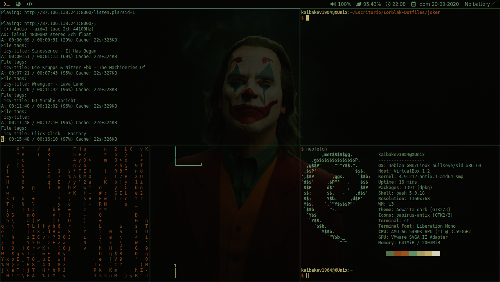

##	Para instalar con Polybar
Es necesario tener instalado [polybar](https://github.com/polybar/polybar).
Una vez que lo tengan instalado, copian los archivos dentro de .config/polybar, en la ruta de configuración `.config/polybar` o donde lo tengan instalado.
Copian el archivo config en el directorio donde tengan guardado las configuraciones de `i3wm` (por defecto es `~/.config/i3`)

Debería verse así: 

##	Para instalar con Py3status
Es necesario tener instalado `py3status`. Una vez que lo tengan instalado, copian el archivo `i3status/i3status.conf` en la carpeta donde tengan instalado (yo lo suelo tener guardado en `.i3/`).

Una vez configurado, es necesario hacer algunos cambios en el archivo *config*.
Los `workspace` los cambiamos por lo siguiente:

        set $workspace1 "1 "
        set $workspace2 "2 "
        set $workspace3 "3 "
        set $workspace4 "4 "
        set $workspace5 "5 "

Con eso estaríamos agregando *íconos* a nuestros *workspaces*. Para tener nuestro *status bar*, necesitamos agregar esto:

        bar {
            status_command py3status -c ~/.i3/i3status/i3status.conf
            position top
            separator_symbol " "
            font pango:DroidSansMono Nerd  10 
            strip_workspace_numbers yes
            # bar colors	
            colors {
		        background $bg-color
	            separator  $inactive-text-color 
	            #                  border             background         text
		        focused_workspace  $bg-color          $bg-color          $text-color
		        inactive_workspace $bg-color 		  $bg-color 		 $inactive-text-color
	            urgent_workspace   $urgent-bg-color   $urgent-bg-color   $urgent-text-color
	            }
            }

En la línea con `status_command py3status -c ~/.i3/i3status/i3status.conf`, la ruta que le pasamos debe ser la que nosotros usemos para guardar la configuración para nuestro *status bar*. En mi caso, lo tengo guardado en `~.i3/i3status/`.

Una vez terminado, debería verse así:

