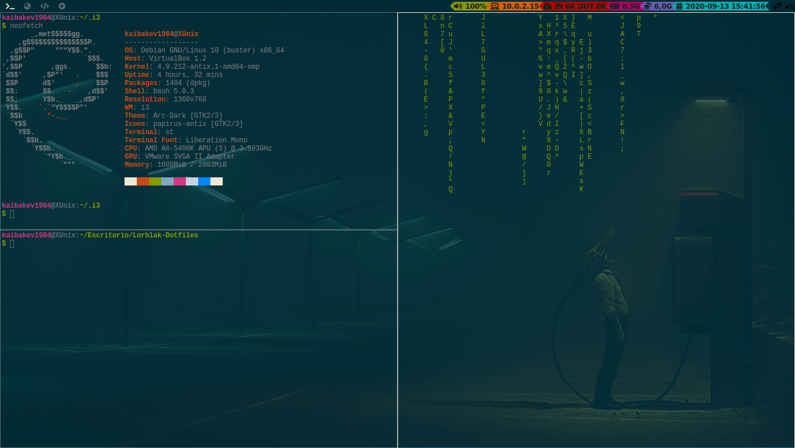
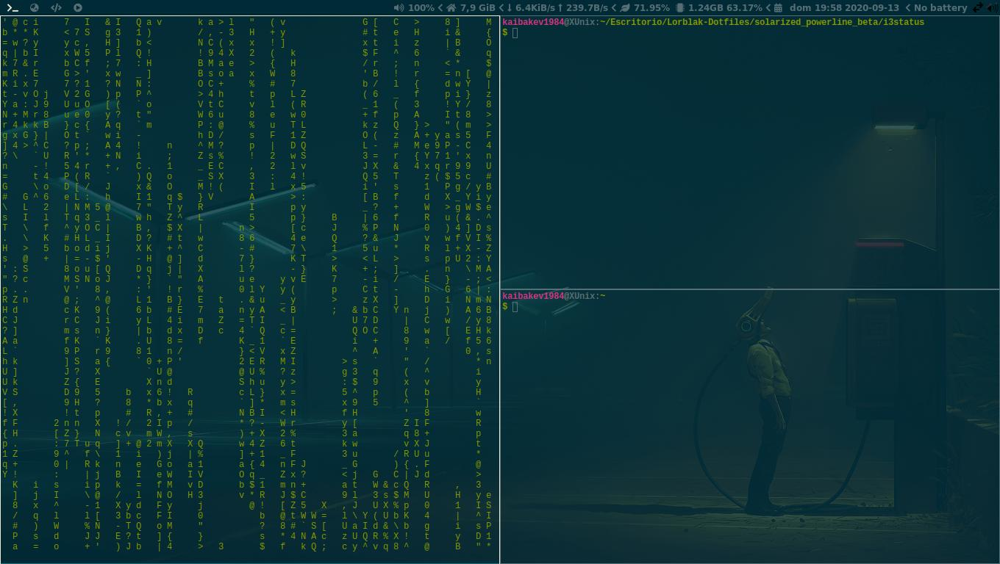

# i3blocks con forma de Powerline
Para poder realizar el estilo *powerline* para **i3blocks**, es necesario 
tener instalado [i3blocks-gaps](https://github.com/Airblader/i3blocks-gaps) (solamente sigan
las instrucciones para su instalación).

Actualmente se trabaja con **separadores** para realizar el efecto en el **i3status**:




##  Opcional: py3status
Como una alternativa a **i3blocks**, tenemos a **py3status**, cuyas instrucciones para la instalación, están [aquí](https://py3status.readthedocs.io/en/latest/intro.html#installation). Lo único que necesitamos es cambiar dentro de nuestro archivo de configuración de i3 de la siguiente forma:

```
    bar {
        status_command py3status -c ~/.i3/i3status/config
        font pango:InconsolataLGC Nerd Font Bold 9
    }

```

**Cuidado**: en mi caso, tengo guardado el archivo de configuración para **py3status** dentro de la ruta especificada. Asegúrense de no sobre escribir el archivo de configuración de **i3**, si es que tienen guardado dicho archivo en esa carpeta. En todo caso,
pueden cambiar el nombre del mismo para asegurarse de que no se sobre escriban.

